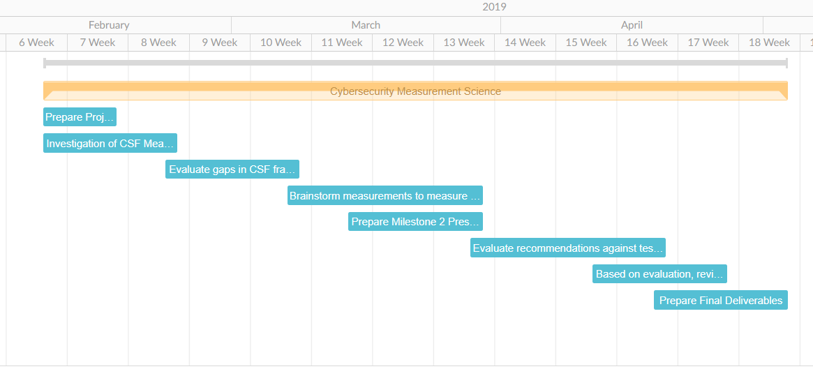
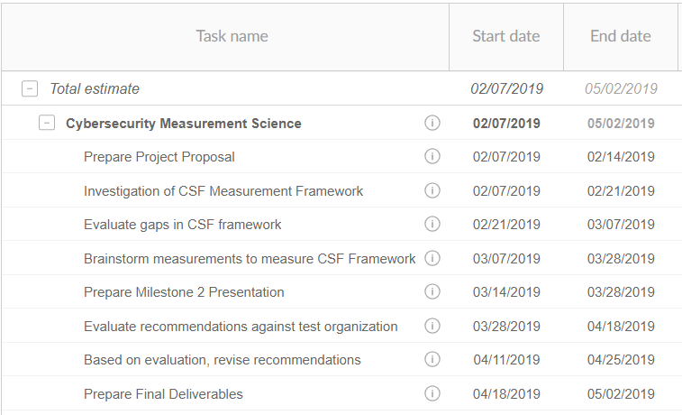

# Cybersecurity Measurement Science

## Executive Summary

Cybersecurity departments across the United States all face a common problem: they spend loads of money and resources on implementing strong security controls with no standard way to measure the effectiveness of those controls.  There are numerous frameworks that exist, including the Cybersecurity Framework from NIST.  However, these frameworks typically are limited to identifying which controls to apply and do not include how to measure the effectiveness of the implemented controls.  As a result, there is a great need for a standard set of metrics which can measure the effectiveness of security controls that have been implemented in a given environment/domain.

The goal of this project is:
1) Determine if it is possible to use the Cybersecurity Framework from NIST (NIST-CSF) as a tool to determine the controls that should be in place for a security tool within the reference frame.  
2) Determine the rating/metric scale to determine the effectiveness of the controls
3) Determine if the rating/metric scale can be applied to the test organization

If this project is successful, the metrics will be able to provide a report card of a security environment/domain.  The end goal would be to be used in an overall report card of a security program effectiveness if all tools could be evaluated with the same standards.  

Team members that will be executing this project are:
1. Lisa Bazis
2. Sarah Noles
3. Collin Daily
4. Lyle Reinholz
5. Sanjar Hamidi

## Project Timeline

The proposed timeline for this project is shown below.  Additionally, a more detailed view with estimated start and end dates is provided.

## Risk List

|Risk name (value)  | Impact     | Likelihood | Description |
|-------------------|------------|------------|-------------|
|Identified measurements are not effective (32) | 8 | 4 | One risk that affects us is that the metrics that we identify for measuring the effectiveness of a cybersecurity program could be ineffective. |
|Identified measurements are too effective (18) | 9 | 2 | One risk that could arise is that the current measurements for effectiveness are very effective leaving our work to be in vain. |
|Time restrictions (42) | 7 | 6 | One risk that could arise is running out of time to complete a task setting us back and endangering the completion of the project |
| Resource restrictions (48) | 8 | 6 | Having limited resources can affect the testing phase of new measurements techniques/tools, which could affect the final outcome of this project. |

*This is Lisa's risk log-- please add to it
The methodology cannot be applied to all systems in the domain
The metrics cannot be standardized across all domains

## Project Methodology
>Methodology is extremely important for conducting a successful project. While I am always a fan of "winging it" when it comes to day-to-day life - winging it is not an option for being successful on a team. Hence, in this class you will be required to develop a technical plan (AKA Methodology) to succeed. Your methodology should be grounded in scientific method and best practice. It should be based on the literature in the area you are working on and should use well-tested methods when possible.  
>Requirements are extremely important for conducting a successful project - of either the creative or assessment-oriented varieties. Collecting requirements about an application means understand what your end user (or what the end user of a product you are assessing) is going to do with the product. To understand requirements we often define user stories and use cases to encapsulate and represent behavior.  
> Submission Requirements

### Literature Review: 

#### Measuring Cybersecurity Effectiveness

#### A Critical Review of the Literature

  In order to improve cybersecurity, it first must have a metric to be measured against. This literature review serves as a look into the current way cybersecurity effectiveness is measured. This review will not focus on the current ways cybersecurity effectiveness can be measured in its individual parts (e.g. Data Centers, Internal Networks, Endpoints, Users, Perimeter) but rather the effectiveness of the system as a whole. The review was successful in finding mentions of different metrics for analyzing the effectiveness of a cybersecurity system.

  In doing this literature review it became clear that there was no one determined way to measure the effectiveness of cybersecurity systems. That being said, there were some interesting ways to find metrics including using economic-returns as a way to assess the effectiveness. This method, introduced by Dr. Paul Garvey and Dr. Susmit Patel at the 2014 IEEE Military Communications Conference, discussed three potential frameworks for measuring the effectiveness of cybersecurity investments. The first of the frameworks is &quot;designed for conducting an economic-benefit return analysis of risk reduction investments in cybersecurity&quot; [1]. This framework, which can be used as a matrix or a graph, shows the mission areas by the capabilities they depend on and the assets those capabilities depend on to accomplish mission objectives. The entries in the matrix are scores that reflect the cyber risk each asset poses to its dependent capabilities, if the asset&#39;s vulnerabilities are exploited [1]. The second of these frameworks chose to do a return analysis from an organizational view. This framework &quot;models the impact of a cyber threat event on the security of systems an organization&#39;s missions and business process depend on to achieve its outcome objectives.&quot;[1]. This framework is also created in part from the NIST Special Publications SP 800-30 Rev. 1,2012. The last framework they discussed is a return analysis on cyber event impact on mission effectiveness. This was &quot;designed for conducting mission level analyses by modeling deep-dives into the impacts of cyber events on the effectiveness of missions at their lower level mission elements.&quot; [1]. In order to accomplish this, they first needed to split missions into mission trees, then assess the potential vulnerabilities and then evaluate the economic-benefit return on threat reducing or mission strengthening investments that improve overall mission effectiveness.

  Carnegie Mellon University also came up with a way to measure cybersecurity effectiveness using the Earned Value Management (EVM) method. EVM calculates actual performance against planned performance across the scope, schedule, budget, and expenses of a project. It uses three different metrics, Planned Value (PV) which is the amount of work, in monetary value, expected to be completed, Earned Value (EV) which is the monetary value of work completed to date, and the Actual Cost (AC) which is the amount of money spent to date. In order to use EVM to calculate effectiveness of a cybersecurity system, they used 4 different dimensions as a way to calculate the performance over a given time frame. The first of these dimensions was Cybersecurity expenditures. This is a comprehensive list of how much money was invested and where it was invested in including the technical (e.g. hardware, software) and non-technical (e.g., personnel, policy development) expenses [2]. They also needed to use actual events and activities that occurred during that time frame, both planned and unplanned. Planned scope of cybersecurity events and activities that the expenditures were intended to address. This covers all events, malicious or unintended attacks, and activities like policy development and execution or monitoring of third-party performance. Lastly, they needed to use the successful handling of these events or activities. Using these 4 dimensions, they were able to come up with a chart that showed indicators of performance. (see fig. 1)

 
Figure 1

   The last piece we wanted to examine in this review was some of the keywords included in these pieces of literature. Below is a short table of some of the important keywords and how often they appeared.

| **Keyword** | **Number of Occurrences** |
| --- | --- |
| Cybersecurity | 72 |
| Risk | 20 |
| Effectiveness | 60 |
| Economic(s) | 61 |
| Security | 14 |
| Measure(ment) | 32 |
| Investment | 60 |

While we did find some frameworks to measure the effectiveness of cybersecurity controls, nothing stood out as being the best form of measurement. We believe that there is a better way to measure the effectiveness of the controls and intend to create a new framework that helps reach this goal.

#### References

[2] Fowler, S. (2018, March 15). _Insider Threat Blog: Cybersecurity Performance 8 Indicators_. Retrieved from Cornegie Mellon University - Software Engineering Institute: https://insights.sei.cmu.edu/insider-threat/2018/03/cybersecurity-performance-8-indicators.html

[1] Garvey, P., &amp; Patel, S. (2014). Analytical Frameworks to Assess the Effectiveness and Economic-Returns of Cybersecurity Investments. _IEEE Military Communications Conference._ Baltimore: IEEE.

### Technical Plan:

We plan on gathering as much data as possible on CSF measurement framework as possible. The primary frameworks we are planning to focus on are the four that were spoken of in the literary review, however with an emphasis on EMV model.  Once we have gathered the data on each of these, we will analyze and compare the different frameworks and evaluate them. This will evaluation will be done on any data that is possible to collect but since organizations don’t give out this information, we will be doing qualitative measurements for this evaluation. The evaluation of the frameworks could lead to potential gaps that we plan to discover and formulate different possible solutions to these gaps. We plan on recommending our framework to the test organization. And based off of their evaluation, we would revise our framework. The data used would be from open source sites, UNO databases, and perhaps from UNO and the test organization. And the data we are able to collect will determine the analysis technique we use on the data. The resources used are our personal computers and campus computers and the test organization. 

## Requirements
> Clearly identify the technologies and products involved in your project.  clearly identify the technologies, products, and languages involved in your project. Include a table that identifies which team member will investigate each needed resource. Also include a column indicating whether or not material resources are needed from Dr. Hale.

|Resource  | Dr. Hale needed? | Investigating Team member | Description |
|-------------------|---------|---------------------------|-------------|
|Test Organization| No | Lisa | We need an organization that we can test our measures and recommendations against.|
